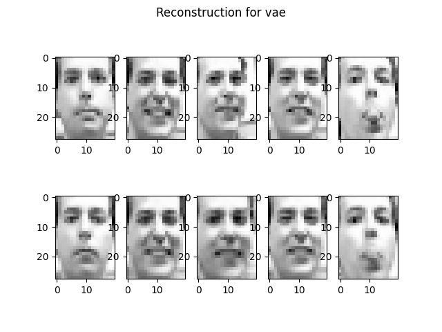
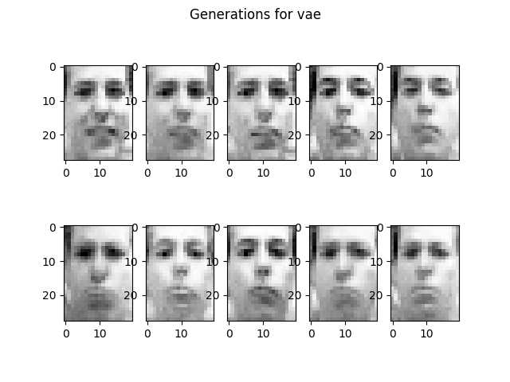

# vae-vampprior

Tensorflow implementation of the VAE with VampPrior paper (https://arxiv.org/abs/1705.07120) for the Machine Learning, Advanced Course at KTH

The model can be trained and used on 3 different datasets:

*   [StaticMNIST](https://www.tensorflow.org/datasets/catalog/mnist)
*   [Fashion MNIST](https://www.tensorflow.org/datasets/catalog/fashion_mnist)
*   [Frey Faces](https://rdrr.io/github/jlmelville/snedata/man/frey_faces.html)

## Installation

1.  Clone the repo
2.  Install python packages (listed in the `requirements.txt` file)
    ```sh
    pip install -r requirements.txt
    ```
    (or alternatevily with conda)

Information about the usage can be obtained by running `python main.py -h`.

## Results

Here are the results obtained with stardard vae on the Frey dataset




## Authors

Implemented by

*   Francesco Zappia (Standard VAE)
*   Vittorio Zampinetti (VampPrior)
*   Marco Schouten (HVAE)

More generally each of the authors influenced and contributed on each other's work.

### Related pages

Part of the implementation is inspired by

*   the authors' implementation of the paper [on GitHub](https://github.com/jmtomczak/vae_vampprior)
*   Tensorflow [tutorials](https://www.tensorflow.org/guide/keras/custom_layers_and_models)

<!-- LICENSE -->

## License

Distributed under the MIT License. See `LICENSE` for more information.
